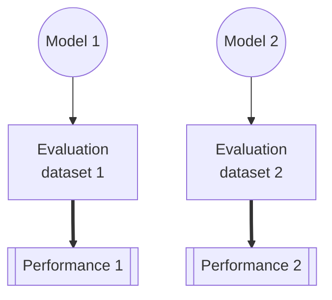
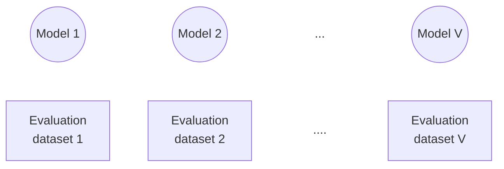

# VIGILANT

> [!NOTE]
> The documentation and demo (both located in the `docs` folder) will eventually be hosted on github pages.
> To preview how the pages will look once hosted, clone this repository (or at least the entirety of the docs folder), and then run the following command (assumed to be run from the project's root directory):
>
> `python -m http.server -d docs`
>
> This command can be run using any python 3 environment. While this server is running, the demo & documention should be accessible at `http://localhost:8000/`

VIGILANT is a measurement toolkit for performance assessment of adaptive AI systems.
The three included measurements &mdash; *learning*, *rentention*, and *potential* &mdash; help to disentangle performance changes due to model adaptations from those caused by shifts in the evaluation environment.

## Background

>[!TIP]
>For a more detailed description of the measurements provided in this repository, see our [open-access paper](Link to be added).

**Adaptive AI** refers to artificial intelligence models developed in multiple discrete versions over time. This differs from *locked models*, which remain unchanged after training, and continually learning models, which treat all incoming data as training data.

The adaptive AI paradigm introduces challenges for performance assessment because both (a) the model and (b) the evaluation dataset may change simultaneously. Consider the example below: if performance improves from *Performance 1* to *Performance 2*, the cause may be either (a) an increase in model capability or (b) a change in the difficulty of the evaluation dataset.



### Measurements
VIGILANT provides three measurements to help separate performance changes due to model updates from those caused by variations in the evaluation data: learning, potential, and retention.

All measurements assume a sequential modification paradigm with $V$ model versions and corresponding evaluation datasets. The score of model $(M)$ evaluated on dataset $(D)$ is represented as $S(M|D)$.


**Learning**: *Improvement in performance from the previous step, measured with respect to the current evaluation dataset.*
  > $learning(M_V) = S(M_V|D_V) - S(M_{V-1}|D_V)$ 

**Potential**: *Change in performance resulting from changes to the evaluation dataset.*
  > $potential(M_V) = S(M_{V-1}|D_{V-1}) - S(M_{V-1}|D_V)$

**Retention**: *The model's maintained performance on previous datasets.*
  > $retention(M_V)=\sum_{v=0}^{V-1}S(M_V|D_v)\times W((V-1)-v)$

Where $W$ is an exponential decay term with tunable parameter $\lambda$; $W(t)=e^{-\lambda t}$.


## Using this tool

This toolkit works with adaptive AI systems developed in discrete model versions, each paired with a corresponding evaluation dataset. The required input is the performance of every model version evaluated on every dataset version.

For example, for model versions 1, 2, and 3 (each with its own dataset), the input format is:

| Model version | Dataset version | Performance |
|---------------|-----------------|-------------|
| $\color{#75cd00}{\textsf{1}}$             | $\color{#75cd00}{\textsf{1}}$               | 0.6         |
| $\color{#00ddd0}{\textsf{2}}$             | $\color{#75cd00}{\textsf{1}}$               | 0.7         |
| $\color{#8557dc}{\textsf{3}}$             | $\color{#75cd00}{\textsf{1}}$               | 0.3         |
| $\color{#75cd00}{\textsf{1}}$             | $\color{#00ddd0}{\textsf{2}}$               | 0.4         |
| $\color{#00ddd0}{\textsf{2}}$             | $\color{#00ddd0}{\textsf{2}}$               | 0.6         |
| $\color{#8557dc}{\textsf{3}}$             | $\color{#00ddd0}{\textsf{2}}$               | 0.8         |
| $\color{#75cd00}{\textsf{1}}$             | $\color{#8557dc}{\textsf{3}}$               | 0.9         |
| $\color{#00ddd0}{\textsf{2}}$             | $\color{#8557dc}{\textsf{3}}$               | 0.2         |
| $\color{#8557dc}{\textsf{3}}$             | $\color{#8557dc}{\textsf{3}}$               | 0.9         |

### Getting Started

VIGILANT can be used either as a Python package (by cloning the [source repository](https://github.com/DIDSR/VIGILANT)) or [through your browser](https://DIDSR.github.io/VIGILANT). Instructions and examples for the browser version are provided within the interface.
Both implementations expect data in the structure shown above.


#### Python

##### Installation

Clone the [source repository](https://github.com/DIDSR/VIGILANT), then cd into the cloned directory (``cd VIGILANT/``).
From this directory, the VIGILANT package can be installed using the command: ``pip install "."``.


##### Minimal example

```python
   import vigilant
   import pandas as pd

   # Direct to the file containing performance data
   data_file = "performance_data.csv"
   
   data = pd.read_csv(data_file)

   """"
   By default, vigilant assumes that model version, dataset version, and performance are
   in columns named "model", "dataset", and "performance", respectively.
   
   This behavior can be changed by adjusting the appropriate keys in the config object.

   The example below indicates that the performance will be found in a column named "AUROC"
   """"

   vigilant.config.performance_key = 'AUROC'

   # Calculate individual measurements
   L = vigilant.learning(data)
   P = vigilant.potential(data)
   R = vigilant.rentention(data)
```
The output of each of the measurement functions is a two column dataframe (`version` and the name of the measurement).

