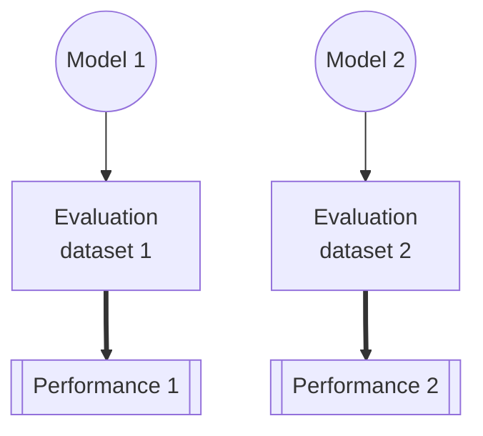
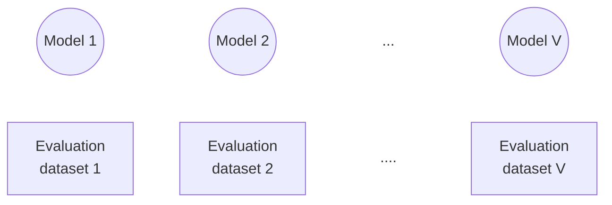

# VIGILANT

> [!NOTE]
> The documentation and demo (both located in the `docs` folder) will eventually be hosted on github pages.
> To preview how the pages will look once hosted, clone this repository (or at least the entirety of the docs folder), and then run the following command (assumed to be run from the project's root directory):
>
> `python -m http.server -d docs`
>
> This command can be run using any python 3 environment. While this server is running, the demo & documention should be accessible at `http://localhost:8000/`

VIGILANT is a measurement toolkit for performance assessment of adaptive AI.
The three included measurements &mdash; *learning*, *rentention*, and *potential* &mdash; help to disentangle performance changes due to model adaptations from those caused by changes in environment.

## Background

>[!TIP]
>For a more detailed description of the measurements provided in this repository, check out our [open-access paper](Link to be added).

**Adaptive AI** are artificial intelligence models that are created in multiple discrete versions over time, in contrast to *locked models* which are static after training or *continually learning models* which use all provided data as training data.

The adaptive AI paradigm presents a challenge for performance assessment: the concurrent changes made to the AI model and the model's evaluation dataset.

Consider the paradigm shown in the figure below, if there is an observed improvement from **Performance 1** to **Performance 2**, it isn't known whether that change resulted from an improvement in the model's knowledge or simply a change in the difficulty of the evaluation dataset.



### Measurements
To help separate changes in model performance due to model knowledge from those observed due to changes in the evaluation data, VIGILANT provides three adaptive AI performance measurements: *learning*, *potential*, and *retention*.

All three measurements assume a sequential modification paradigm of $V$ model versions, each with a corresponding evaluation dataset, where the score of model $(M)$ measured on evaluation dataset $(D)$ is represented as $S(M|D)$.


**Learning**: *Improvement in performance from the previous step, measured with respect to the current evaluation dataset.*
  > $learning(M_V) = S(M_V|D_V) - S(M_{V-1}|D_V)$ 

**Potential**: *Change in performance resulting from changes to the evaluation dataset.*
  > $potential(M_V) = S(M_{V-1}|D_{V-1}) - S(M_{V-1}|D_V)$

**Retention**: *The model's maintained performance on previous datasets.*
  > $retention(M_V)=\sum_{v=0}^{V-1}S(M_V|D_v)\times W((V-1)-v)$

Where $W$ is an exponential decay term with tunable parameter $\lambda$; $W(t)=e^{-\lambda t}$.


## Using this tool

This toolkit is designed to be used with adaptive AI developed in a sequential modification paradigm. It is expected that there are multiple sequential versions of the AI model, each with a corresponding evaluation dataset.
The input to this tool is the performance of every version of the model, evaluated on every version of the evaluation dataset.
For example, a model with the versions 1, 2, and 3 (each with a corresponding dataset), would have an input in the format:

| Model version | Dataset version | Performance |
|---------------|-----------------|-------------|
| 1             | 1               | 0.6         |
| 2             | 1               | 0.7         |
| 3             | 1               | 0.3         |
| 1             | 2               | 0.4         |
| 2             | 2               | 0.6         |
| 3             | 2               | 0.8         |
| 1             | 3               | 0.9         |
| 2             | 3               | 0.2         |
| 3             | 3               | 0.9         |

### Getting Started

VIGILANT can either be utilized as a python package (by cloning the [source repository](https://github.com/DIDSR/VIGILANT)) or [through your browser](https://DIDSR.github.io/VIGILANT). Instructions and examples for the browser version are provided within the interface.
Both implementations expect your data to be in the structure shown in the example above. 


#### Python

##### Installation

Clone the [source repository](https://github.com/DIDSR/VIGILANT), then cd into the cloned directory (``cd VIGILANT/``).
From this directory, the VIGILANT package can be installed using the command: ``pip install "."``.


##### Minimal example

```python
   import vigilant
   import pandas as pd

   # Direct to the file containing performance data
   data_file = "performance_data.csv"
   
   data = pd.read_csv(data_file)

   """"
   By default, vigilant assumes that model version, dataset version, and performance are
   in columns named "model", "dataset", and "performance", respectively.
   
   This behavior can be changed by adjusting the appropriate keys in the config object.

   The example below indicates that the performance will be found in a column named "AUROC"
   """"

   vigilant.config.performance_key = 'AUROC'

   # Calculate individual measurements
   L = vigilant.learning(data)
   P = vigilant.potential(data)
   R = vigilant.rentention(data)
```
The output of each of the measurement functions is a two column dataframe (`version` and the name of the measurement).

